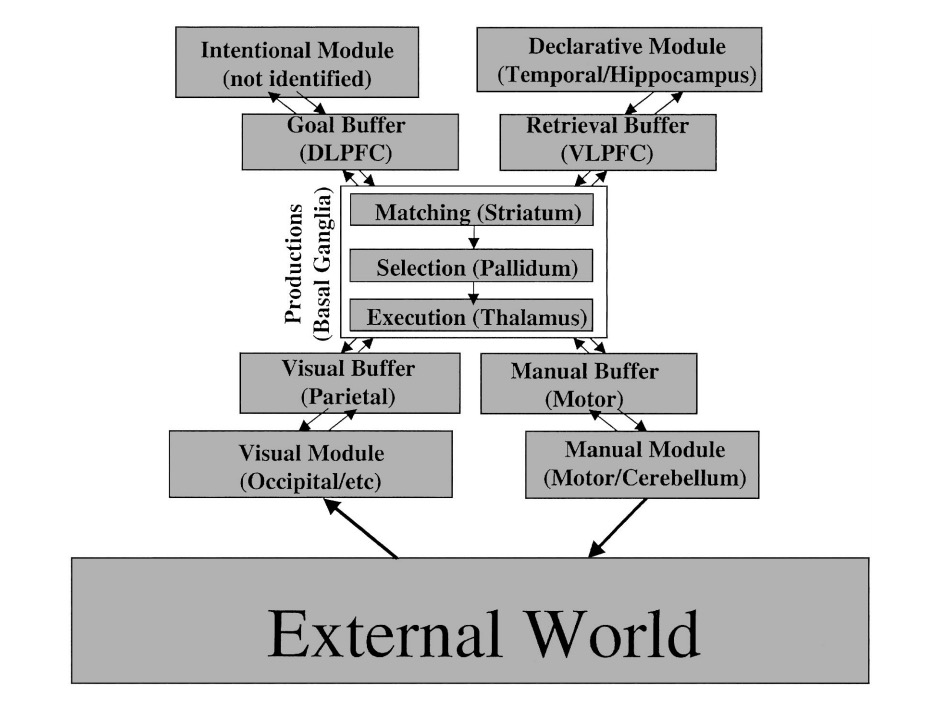
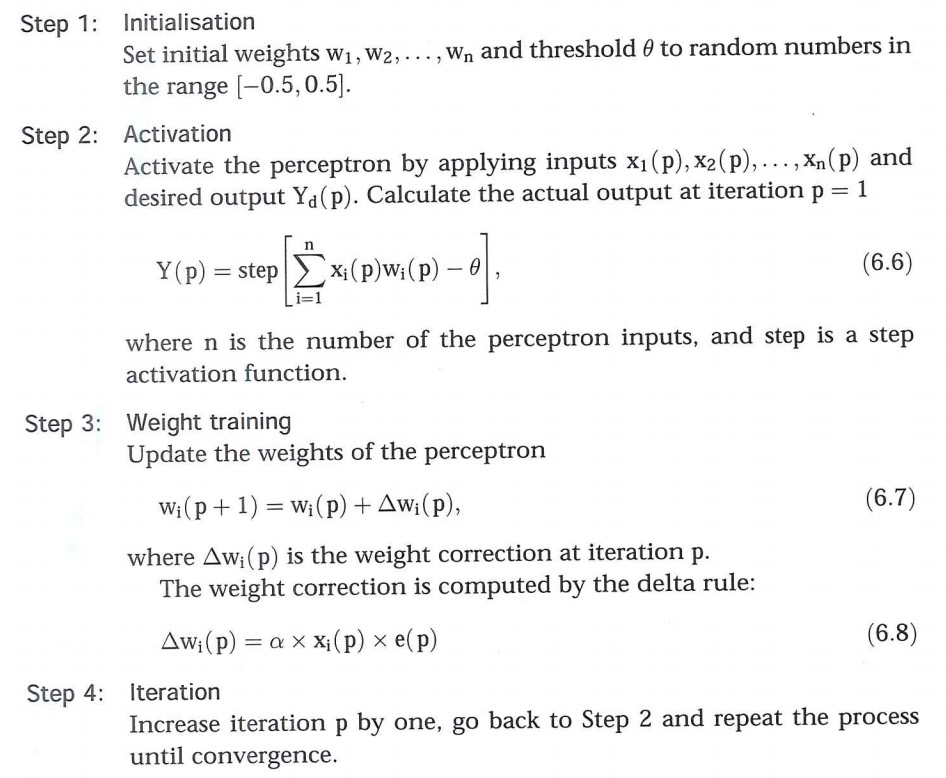
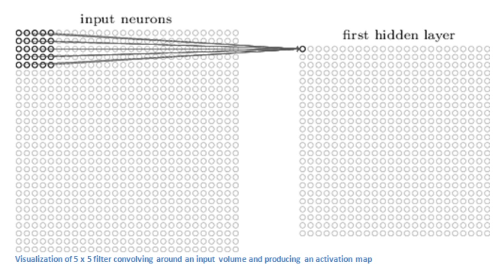

# Kognitive Arkitekturer Notater

## Article 1: The Nature Of cognition

### 1.2 Aspects of modelling cognitive systems
1. How much inspiration from natural systems?
2. How faithful we should be copying them
3. How important is the physical structure?
4. How we seperate the identification of cognitive capability from the way we eventually decide to implement it

* We try to blend computational systems and a bio-inspired system.
 - The bio inspired approach is hard, as we have to understand how the biological system works. Have to choose the level of abstraction

* The ultimate proximate distinction
 - Ultimate explanation: Why does an agent do an action
 - Proximate explanation: How does an agent do an action

### 1.3 So, What is Cognition Anyway?
The answer to the question depends on the context - on the relationship between brain, body and environment.

* Cogntion implies an abality to make inferences about events in the world around you. 
* To make inferences the agent should be able to remember events in the past to make inferences on future actions.
 
 => Cognition involves predicting the future based on the past, 	percepts, and anticipating the effects of the action. 

* A cognitive must learn by observing what actually happens.

* Def: Cognition is the process by which an autonomous system perceives its environment, learns from experience, anticipates the outcome of events, acts to pursue goals, and adapts to changing circumstances. (This definition will change later on in the course)

* Six important aspects of cognition to remember:
	
	1. Autonomy
	2. Perception
	3. Learning
	4. Anticipation
	5. Action
	6. Adaptation
* Also important to remember the meta-functional charcteristics such as dependability, reliability, robustness...
* This is important because the agent will usually operate in partially observable environments.
* When interracting with humans, the agent should have some form of cognition and anticipate the goals of the humans. 

#### 1.3.1 Why Autonomy?
* Two primary functions:
 1. To increase the system's reportoire of effective actions.
 2. Extend the time-horizon of its ability to anticipate the need for and outcome of future actions.

* Autonomy is a characteristic that enables agents to use their capacity to remain viable => to stay alive. Also important for the agent to self maintain. Adapt to the world around it.

* Also important for an agent to react effectively.
 - For a biological agent the delay between when something happens and the time it takes for the agent to react is calles latency, and is often to great for the agent to ract effectively. Therefore, it is important for the agent to be able to anticipate the future => To be able to prepare the action it may need
* Other limitations are on the agent's body; i.e if an agent has to catch an object, it needs to start moving a hand before the object arrives.

### 1.4 Levels of Abstraction in Modelling Cognitive Systems

* All systems can be viewed at different level of abstraction:
 - Low-level: If we should build a bridge we can only look at the different components: the road, suspension cables, etc.. This way we can only know if the bridge will stay up after we build it.
 - High-level: Can also look at the forces that effect the different components, tidal forces, wind conditions, temperature etc

* Often very difficult to decide on what level of abstraction one should use.
* Modelling the human visual system, David Marr created a three-level hierarchy of abstraction:
 1. Computational theory
 2. Representation and algorithm
 3. Hardware implementation

 - One should be able to view these levels independantly and implement each level after the other, starting at computational theory and moving downwards
 - Since many people believe that both cognitive systems - both biological and artifical - are information processors, this abstraction hierarchy is very useful

* Many people belive this model simplifies too much; the variables are not linear. The collective variables are are tightly coupled and mutually dependent.

## Article 2: Paradigms of Cognitive Science

From the first article we have a defined four characteristics defining a cognitive system

1. biological inspiration vs. computational theory
2. level of abstraction of the model
3. mutual dependence of brain, body and environment
4. ultimate-proximate distinction between what cognition is for and how it is achieved

However, there are many traditions of cognitive science, and this article will take a look at a few of these.

* Cognitive science is a general umbrella term that embraces several diciplines; neuroscience, cognitive psychology, linguistics, epistemlogi, AI, etc.
* The goal is to understand the and explain the underlying processes of cognition.

* This article will take a look at the three diferent traditions of cognitive science

### 2.1 The Cognitivist Paradigms of Cognitive Science

#### 2.1.1 An Overview of Cognitivism
* Started at a conference at Dartmouth College in 1956, where the sister dicipline of AI also was invented
* The main idea is that cognitivism is ahieved by computations performed on internal symbolic knowledge represantations (intro AI)
* Labelled the **information processing or symbol manipualtion** approach to cognition.
* Use symbolic representations as an abstraction of the world and its state. The agents can make inferrences about the world around it and how it should behave in order to do something useful.
*  Example: If an item of clothing is soiled  but it is a delicate fabric, the agent can select a cool wash cycle, instead of putting it on a hot-water cycle.
*  A drawback is that the agent needs to know this. To solve this, agents can share their domain knowledge directly, and since the agents use the same framework for knowledge represantation this is fairly easy.
*  This is the power of the cognitivist perspective on cognition and knowledge.
*  This is powerful because the knowledge describes things *in general*, which means that it doesn't describe a particular object, but all the objects relevant to the domain.
*  For agents to be able to share knowledge between each other, the domain knowledge needs to be represented and described in the same way. This leads to an issue, as most agent's knowledge is created by a human designer, and humans can describe things differently.
 - If this is achieved, the cognitive approach becomes very powerful, as knowledge can be directly embedded into an artificial cognitive agent.

#### 2.1.2 Cognitivism and Artificial Intelligence
* Cognitivist science and AI share a common beginning and were developed together, building a strong symbiotic relationship over a period of ~30 years. AI then diverged somewhat from its roots to issues more concerned with practical expediancy and purely computational algorithmic techniques such as statistical machine learning. AI has, however, seen a return to its roots of cognitivist science, now under the banner of Artificial General Intelligence(AGI)
* Will discuss Allen Newell(<3) and Herbert Simon's "Physical Symbol System" approach to AI.
* They present 2 hypothesis:
 1. The *Physical Symbol System Hypothesis*: Any system that exhibits general intelligence is a physical symbol system, and any physical symbol system of sufficient size can be configured somehow to exhibit general intelligence.
 2. The *Heuristic Search Hypothesis*: Symbol systems solve problems by heuristic search. **"All AI is search"**. The point is that a physical system must search for a solution, but is still intelligence becuase the search strategy is efficient enough to come to a solution in a reasonable amount of time.
* A physical symbol system is a machine that produces over time an evolving collection of symbol structures.

From Newell and Simon:
> Symbol systems are collection of patterns and processes, the latter being capable of producing, destroying, and modifying the former. The most important properties of patterns is that they can designate objects, processes, or other patterns, and that when the designate processes, they can be interpreted. Interpretation means carrying out he designated process. The two most significant classes of symbol systems with which we are acquainted are humen beings and computers.

*  Perfect intelligence implies complete utilization of knowledge.

*Principle of knowledge* defined by Allan Newell <3:
> If an agent has knowledge that one of its actions will lead to one of its goals, then the agent will select that action.
 
* This formalizes the idea that an intelligent agent will never ignore something if it knows it will help achieve its goal.
* Newell characterizes a symbol system as follows:
 1. *Memory*
 2. *Symbols*
 3. *Operations*
 4. *Interpretations*
 5. *Capacities* for *composability*

* Newell defines four band of operation, depending on the timiescale over which processing takes place.
 1. Biological: 10^-4 to 10^-2 seconds
 2. cognitive: 10^-1 to 10 seconds
 3. Rational: 10^2 to 10^4
 4. Social: 10^5 to 10^7

 
 ### 2.2 The Emergent Paradigm of Cognitive Science
* The ultimate goal is to maintain the agent's own autonomy, and this is accomplished by cognition
* Done through a process of self-organization whereby the agent only interacts with the world in a way that will not threaten its own autonomy
* Cognition makes sure that the agent's autonomy is not compromised but is continually enhanced
* The system constructs its reality as a result of its operation in that world. This will therefore be dependent on the system's history of action => its experiences.
* These approaches adhere to the principle that the primary mode of cognitie learing is through the acquisition of new anticipatory skill rather than knowledge.
* Emergent system eembrace the idea of the interdependence between brain, body and world, and is often reffered to as *embodied cognition*
* Emergent systems are often categorized into three approaches:
 1. connectionist systems
 2. Dynamical systems
 3. Enactive systems
 
 #### 2.2.1 Connctionist Systems
* Rely on parallel processing of non-symbolic distributed activation paterns in networks of relatively simple processing elements.
* Use statistical properties rather that logical rules to analyze information
* Will learn more about this approach when talking about neural networks, which is based on this approach.

 
## Article 3: The Psychology of Human-Computer Interaction
### 2.1 The Model Human Processor
* The human mind can be viewed as an information-processing system
* **The Model Human Processor** can be described as a set of memories and processors together with a set of pricilpes, hereafter called the "principles of operation"
* The Model Human Processor is divided into three interacting subsystems:
 1. The perceptual system: Consists of sensors and associated buffer memories, such as Visual Image Store and Auditory Image Store
 2. The Motor system: carries out the response
 3. The cognitive system: receives symbolically coded information form sensory image stores 

* The memories and processors are described by:
 1. µ, the storage capacity in items
 2. δ, the memory decay time of an item
 3. k, the main code type (physical, acoustic, visual semantic)
* The most important parameter of a processor is
 - ℸ, the cycle time

#### The Perceptual System
* Carries sensation of the physical world through images, sounds thoughts etc.

#### Perceptual Memories
* Very shortly after the onset of a stimulus, a representation of the stimulus appears in the Storage of the MHP
* The stimulus will decay within some amount of time, and we often refer to the half life as : δ_VIS = 200[90~1000]msec for Visual Image Store and δ_AIS=1500[900~3500]msec

#### Perceptual Processor
* The cycle time ℸ_p of the Perceptual Processor is identifiable with the so-called unit impulse response(Tthe time response of the visual system to a very brief pulse of light) and it duration is on the order of: ℸ_p = 100[50~200]msec. If a stimulus impingen upon the retina at time t = 0, at the end of time t = ℸ_p the image is available in the VIS and the human claims to see it.
* Different images, can be perceived similarly depending on the conditions. For example, an image of high intensity and short duration, can be perceived as the same as an image of lower intensity but longer duration. This can also be applied to acoustic perceptions.

#### The Motor System

* Thought is translated into action by activating patterns of voluntary muscles. These are arranged in pairs of opposing agonists and atagonists, fired on shortly after the other

#### The Cognitive System
* In simple tasks the cognitive system serves to connect inputs from the perceptual system to the right outputs of the motor system. However most tasks are complex and involde learning, retrieval of facts, or the solution of problems.

#### Cognitive Memories
* Two types of memory:
 1. **Working Memory** to hold the information under currend consideration
 2. **Long-Term Memory** to store knowledge for future use. 

* The working memory consists of a subset of the Long-Term Memory
 - We will often use percepts and divide them into different chunks. For example the string BCSBMICRA can be divided into three chunks: BCS, BMI, CRA.
 - Different chunks can also be related to other chunks. A BIRD will also give us the chunks FLY, WINGS, etc.
 - As more chunks are entering Working Memory, the older chunks will *fade* with time.

* The storage capacity µ_LTM = ∞. However, successful retrieval of a chunk depends on whether associations to it can be found. Can fail for two reasons.
 1. Effective retrieval associations cannot be found.
 2. Similar associations to several chunks can interfere with the retrieval of the target chunk.

* Items cannot be added to Long-Term Memory directly; items in Workin Memory have a certain probability of being retrievable late from Long-Term Memory. The more associations the item has, the greater its probablity of being retrieved.

#### Cognitive Processor
* The *recognize-act cycle*, similar to the fetch/execute-cycle, is the basic quantum of cognitive processing. The contents of Woking Memory initate associatively-linked actions in Long-Term Memory ("recognize"), which in turn modigy the contents of Workin Memory("act"), setting the stage for the next cycle. Plans, procedures, etc. are built up of an organized set of recognize-act cycles.

## Article 4: Unified Theories of Cognition
### 2.2 Knowledge Systems
How should we describe knowledge? 

* Describing it in terms of feedback, gain, oscillation, damping and so on, becomes too restricted. We are interested in the full range of human behavior

## Article 5: A Gentle Introduction to SOAR(Denne er en jævla madderfakker)

### 1. Introduction
The different diciplines of cognitive science are all attemps to answer different questions on cognition, and help advance different cognitive phenomena, such as AI, psychology, learning, etc. Each dicipline asks certain types of questions and accepts certain answers. This is both an advantage and a problem, according to Newell.

* An advantage is that each dicipline provides expertise concerning the questions the relevant to it. For example, psycholinguists have been responsible for documenting a regularity called the *garden path phenomena*, which contrasts sentences that are both grammatically correct, altough some are easy to understand, and some are not:
 1. Without her contributions we failed.
 2. Without her contributions failed to come in.
* These sentences help to constrain theories of how humans understand language.

* A problem with many different diciplines is that they all provide different theories, often called *microtheories* - small pieces of the big picture that fail to fit in with all the other pieces. If we look at cognitive science as a big picture, then a microtheory is a way of cutting out a portion, and some theories will overlap, but still come up with different answers.
* Newell wanted to put all the whole picture together and tried to buil *unified theories of cognition* (UTCs), and started working on Soar. 
* A key piece of the Soar program, is the architecture

### 2. The Idea of Architecture

* A machine's hardware architecture is dependent on the tasks it is required to do. Therefore, the best way to ask if a specific architecture is designed well is to as: "Does machine M run applications A and B efficiently?" rather than "Does machine M work well?"
* We can also look at the software as having an architecture that describes the application on a higher level, and how it should behave to different tasks.

BEHAVIOR = ARCHITECTURE + CONTENT

* Architecture is useful because it allows us to factor out some common aspects of the wide array of behaviors that characterize the content.
* A particular architecture stands as a theory of what is common among much of the beavior at the level above it.
* *Cognitive architecture* will then be a theory of the fixed mechanisms and structures that underlie human cognition.

In the following sections(3-11) we will use the different structures and mechanisms of the Soar architecture to construct a computational model that describes intelligent behavior.

### 3 What cognitive Behaviors Have in Common

* We use any computational architecture to model some cognitive behavior. Almost all day-to-day task requires this, such as cooking food, solving equations, playing a game, etc.
* Every achitecture is a theory about what the content it processess have in common, Soar is a theory of what cognitive behaviors have in common. The Soar theory believes that cognitive behavior have at least the following characteristics:
 1. **It is goal-oriented.**
 2. **It takes place in a rich, complex, detailed environment**: Even though the ways in which we perceive the world is limited, the world consists of a huge amount objects, qualities of objects, actions, etc.
 3. **It requires a large amount of knowledge**
 4. **It requires the use of symbols and abstractions.**
 5. **It is flexible, and a function of the environment.** Human cognition isn't just a matter of following a fixed plan, it's also a matter of thinking in step with the world.
 6. **It requires learning from the environment and experience.** 

*  This helps identify some properties of cognitive behavior that Soar must support, and should help constructing our architecture by tying the specific structures and mechanisms back to these properties.

Consider a rookie baseball pitcher, Joe Rookie about to throw his first MLB pitch.
  
1. He has to classify his goals, which is ultimately to win the game, and this can be divided into subgoals for every pitch. 
2. He has to be aware of his surroundings, such as amount of outs, strikes, balls, his teammates etc.
3. Uses his knowledge of the batter's record, and throws accordingly.
4. Behaves in response to his environment; is it windy? Is the batter left or right-handed. If the ball is hit, Joe must change his subgoal to the new situation.
5. Since the pitcher has never played in this game before, he must use his previous experience by abstracting away from this day and place.
6. Joe must learn from previous actions and situation to improve his game in order to stay relevant.

### 4. Behavior as Movement Through Problem Spaces
There are many conditions to consider after a given action. In Joe Rookie's case, once he has thrown, the resulting states can be a variety of different conditions. If he threw a strike or a ball, he has to face the same batter. The batter can have hit the ball and moved on to a base, and Joe has to pitch against another batter. This state space can become big, and we have to define how Joe should act in the different states. He also has to consider past actions, the history of the different batters, and so on. This situation is to move through a problem space. This is useful, as we get a *static* view of how Joe's situation, and use this information to pick the next action. We also get a *dynamic* view of Joe's situation, which can be used to talk about the actual path that Joe has taken through his problem space.

* The different states Joe can be in are defined as a vocabulary of features and their poosible values. The state defined as all the aspects of the current situation, Joe's internal and external state, that the model will need to decide what action Joe should do on the next pitch.
* Movement between current state and a new state is defined by the operator that tranforms the features and values.
* To solve a problem, operators must be applied to move through the problem space. To keep the behavior goal-oriented the operators applied to the state must be guided by *the principle of rationality*: "if an agent has knowledge that an operator application will lead to one of its goals then the agent will select that operator".

To express the knowledge the agent has in a goal oriented way, the knowledge has to be represented in terms of goals, states, and operators and guiding the choice of which operator to apply by the principle of rationality.

This gives us a new problem. What knowledge becomes part of the state and what knowledge becomes part of the operators? How do we know what an operator application will do? How do we know when the goal has been achieved?

### 5. Tying the Content to the Architecture
We have to be able to group the different kinds of knowledge from:

1. Knowledge about things in the world
2. Knowledge about abstract ideas
3. Knowledge about physical actions
4. Knowledge about mental actions
5. How to use the other kinds of knowledge.

All these are domain specific depending on the situation the agent is in. In Soar we must find what is common among across all domains  and problems. It is the decomposition from the knowledge into goals, problem spaces, states and operators.

* The state must have some feature that defines the goal(s). This way the current state can be evaluated if there has been any progress towards the goal.
* Each operator has to use content knowledge to determine when it is relevant to the current goal and the current state. In the baseball game it is not relevant to consider operators that is relevant for laundry or making food, it is the different pitches Joe can choose. That way we know the actions will be goal-oriented.
* Domain knowledge is required to know whether or not an operator has achieved a desired state. This can be from a signal from the outside world, or other factors.

One also has to consider the possibility of augmenting the goal and problem space over time. In the baseball game, there are a lot of actions that change the goal, such as an opposing player on a base, or if rain is coming. This makes the subgoal a bit different than if it is only one batter and no players on base. Joe has to consider the player on base, so he cannot steal a base, as well as making sure the batter does not hit. This is where subgoals become relevant, and we will come back to that in section 7. 

### 6. Memory, Perception, Action, and Cognition 

In the real world it is important to use our knowledge about objects and actions that are actually relevant in the pursuit of our current goals. Joe Rookie does not car about his knowledge of laundry when pitching in baseball. Soar will therefore divide knowledge into two types of memory: Long Term Memory and Working Memory.

* Long Term Memory(LTM) is divided into three:
 1. Procedural: how and when to do things
 2. Semantic: Facts about the world and its objects
 3. Episodic: Thing you remember
* LTM is not directly accessible but must be searched to find what is relevant to the current situation.

* Working Memory(WM) is the knowledge that is relevant to the current situation.

* Procedural knowledge is primarily responsible for controlling behavior and maps directly onto operator knowledge. We will define this as a set of if-then rules. The rules are dependent on each other and will move downwards. Rule r2 will not be fired and suggested until r1 has.

* For tasks where a model has sufficient procedural knowledge, it does not require semantic and episodic knowledge. These are only applied if there is insufficient knowledge

* A decision cycle is a fixed processing mechanism in the Soar architecture that does its work in five phases: *input, elaboration, decision, application and output*.
 - During input, the WM elements are crated that match the percepts.
 - Elaboration matches the if parts of the rules in long-term memory. All rules that match from procedural memory will fire in parallell. We will move down the list of rules, and receive suggestions and actions to consider. These are those that match the if-part of the statement. We cannot fire until we are done in order to maintain the principle of rationality.
 - The decision phase will start when all possible matches from LTM are retrieved, and the agent has to make a decision. The suggestions will have values that define the "strength" of the suggestion, and we will know if some are preferred over others.
 - When a suggestion is chosen, we will need to apply it produce the state transition that completes a move in the problem space. 
 - The motor command will then be sent to the Perception/Motor Interface to the external environment, leading to a pitch be thrown. We will then receive new percepts that happens after the operator has been fired.

* Only a single operator can be chosen at a time, but paralell actions can be wrapped into a single operator. For Joe, we consider a single throw as an operator, even though this involves Joe moving his arm, legs, throwing the ball etc.

### Detecting a Lack of Knowledge
* If does not have enough rules to determine **exactly** on action, and ends up with multiple suggestions with no way of determining what operator to choose, we reach an **impasse** => what happens when a decision cycle can't decide. 
 - Soar creates a substate that represents the information relevant to resolving the impasse(including the original state)
 - In the substate, all the same procedures happen, it selects and applies operators to achieve a goal, but in this case the goal is to select the best operator in the tie, and the operators will attempt to retrieve and compare knowledge about the operator. We will not produce and action in the external environment.
 - In the baseball case, the pitcher can look at the history in episodic memory he has with the different operators against the current batter.
 - We have to create rules that enables us to evoke previous knowledge.
 - Cannot always get knowledge that matches the state exactly, but we will get the closest match

 * Working memory will actually consist of a state/substate hierarchy where each substate exists in order to resolve an impasse in the problem space above it.  

 * Operator *no-change impasse* occurs when knowledge about when to select an operator is available, but knowledge about how it changes the state is unavailable. This is what is referred to as delibarate goal, where a complex problem is decomposed into simpler problems 

 
### 8. Learning
* Learning is that acquired knowledge changes our behavior over time. 
* Should consider three questions that arise when talking avout systems that learn:
 1. What do they learn? 
 2. What is the source of knoewledge for learning?
 3. When do they learn?

* Soar systems learn structures for its long-terms memories: rule, declarative facts, and episodes.
* From our equation BEHAVIOR = ARCHITECTURE + CONTENT, we know that the architecture is a set of *fixed* structures, so this cannot be changed, and therefore it is the content that need to change.
* In Soar the are four different learning mechanisms:
 1. Chunking
 2. Reinforcement learning
 3. Episodic memory
 4. Semantic memory

 
#### 8.1 Chunking
* This is the process of learning new rules for LTM from substates, as explained in the impasse situations. This occurs in the situations in which the knowledge is insufficient, and the impasse situations tells us that the agent needs to learn something new. 
* The rules that are made in this process, and not by the designer himself, are called chunks.
* The rules are created as a statement with every part of the original state that led to the impasse in the if statement, and the *then* part of the statement is the knowledge elicited while in the substate. An example from the article is:
 > (c1) If both the throw-curve-ball and throw-fast-ball operators are suggested and the
batter-name is Sam Pro and the batter is left-handed and the weather is windy then
prefer the throw-curve-ball operator. 
* As a theory, Soar says that chunking happens all the time, and is almost like a mechanism that requires no intention to learn on the agent's part. It is merely a procedure that happens when an impasse occurs because of lack of knowledge, and the chunks arise when knowledge becomes available when the knowledge becomes available that resolves the impasse.

#### 8.2 Reinforcement Learning
* A source of knowledge that occurs outside of the internall reasoning of the agent is called **feedback**, or **reward**, from the external environment. This can be either positive or negative, such as pleasure or pain, or an emotional reaction to a situation. In the baseball example, this can be winning the game, getting an out, throwing a strike, etc.
* The agent will use this feedback as a way to know if it wants to maintain a situation on positive feedback, and vice versa. This reward can also be used to impact long term behavior.

* Soar must learn rules that test the appropriate features of the states and operator, as well as approximating the expected rewards for each rule.
* We will create rules based on rules that propose operator, and later specialize these if they do not include enough conditions. Each rule will have assigned values that predict the expected reward on the operator. 
* After an operator is chosen, we will then update the value based on the outcome of the operator in the next state. This way the selection of operators will improve over time.

#### Episodic Memory
* Episodes are recorded in LTM as events happen to the agent, and will increase over time. Every episode will contain a subset of the working memory that exist during time of recording.
* Episodic memory will help the agent predict an outcome of an action based on previous experience, and to keep help of long-term goals.
* Episodic memory is a more passive way of learning, and is more a tool for creating chunks by retrieving episodes, as well as helping reinforcement learning.

#### Sematic Memory
- Is the more general knowledge about actions and events, rather than single occurences on specific entities and events and relathionships between them. For the baseball example, semantic memory will include the rules of baseball, how many strikes and outs a batter gets, etc.

### 9. Putting it all Together: A Soar Model of Joe Rookie
1. We specify the knowledge Joe needs => our content.
2. Tie the knowledge to state structures and operators
3. Specify relathionships between different levels by the impasses that will arise and the kinds of knowledge that will be missing.

### 10. Stepping back: The Soar Architecture in Review
A cognitive architecture is a fixed set of mechanisms and structure that process content to produce behavior. At the same time, however, it is a theory about what cognitive behaviors have in common. For Soar, we have: 

* **States and operators**
* **Working Memory** that conatains perceptions and the and hierarchy of states and operators. The contents will trigger retrieval from LTM
* **Long-term memory** that is divided into three parts: Procedural memory, semantic memory and episodic memory
* **The Perception/Motor Interface** that maps percepts from the external world to internal representation in WM
* **The Decision Cyle** 
* **Impasses** 
* **Four Learning mechanisms**: Impasses, reinforcement learning, episodic memory and semantic memory

## Article 6: An Integrated Theory of the Mind

As a field's complexity increases, specialisations arise to describe specific areas within that field. This is so that we can certain questions that arise, and this can very not often be answered in a general term. For a cognitive architecture we previously looked at Newell's Soar theory, of which he tries to explain an integrated cognitive mind as a unified theory of cognition. In this article we will look at a different theory, called **Adaptive control of thought-rational (ACT-R)**. Below is a quote from Newell in which he tries to explain what an integrated system is like.
>A single system (mind) produces all aspects of behavior. It is one
mind that minds them all. Even if the mind has parts, modules,
components, or whatever, they all mesh together to produce behavior.
Any bit of behavior has causal tendrils that extend back through large
parts of the total cognitive system before grounding in the environmental
situation of some earlier times. If a theory covers only one part
or component, it flirts with trouble from the start. It goes without
saying that there are dissociations, independencies, impenetrabilities,
and modularities. These all help to break the web of each bit of
behavior being shaped by an unlimited set of antecedents. So they are
important to understand and help to make that theory simple enough
to use. But they don’t remove the necessity of a theory that provides
John R. Anderson, Daniel Bothell, Scott Douglass, and Yulin Qin,
Psychology Department, Carnegie Mellon University; Michael D. Byrne,
Psychology Department, Rice University; Christian Lebiere, Human Computer
Interaction Institute, Carnegie Mellon University.
This research was supported by National Aeronautics and Space Administration
Grant NCC2-1226 and Office of Naval Research Grant
N00014-96-01491.
Correspondence concerning this article should be addressed to John R.
Anderson, Department of Psychology, Carnegie Mellon University, 352
Baker Hall, Pittsburgh, PA 15213. E-mail: ja@cmu.edu
Psychological Review Copyright 2004 by the American Psychological Association
2004, Vol. 111, No. 4, 1036–1060 0033-295X/04/$12.00 DOI: 10.1037/0033-295X.111.4.1036
1036
the total picture and explains the role of the parts and why they exist.

### The ACT-R 5.0 Architecture

The ACT-R architecture is divided into several different modules that control different parts of an agent's behaviour or its knowledge. Each module has a buffer in which they communicate information with the other buffers. For example, the declarative model, which retrieves all the information from memory, only has accessible information to the central production system through its buffer

All of the different modules try to relate to an actual part of the human brain, and the article makes this stuff hard to relate to with fancy words. The most important part is to understand how the different buffers communicate with other modules of the architecture.

####The Perceptual-Motor System
ffd

## Article 7: Evolution of the ICARUS Cognitive Architecture

### Introduction
Cognitive architectures try to specify the computational infrastructure that underlies intelligent behavior. They specify factors that remain constant across different domain, regardless of the conents. This includes memories, represantation of memories, and the processes that operate over the elements. 

Remember BEHAVIOR = ARCHITECTURE + CONTENT 

We incorporate ideas from psychology about the human mind, specifically how we process information. In this article we are introduced to ICARUS, a cognitive architecture similar to Soar and ACT-R, but also makes some distinctive commitments.

### Theoretical Claims of ICARUS

Some cognitive frameworks are mostly concerned with explaining human cognition, while others the construction of intelligent agents. ICARUS falls in the middle of this spectrum. ICARUS has some core assumptions about cognition that are common in many other frameworks:

1. *Short-term memories are distinct from long-term stores*
2. *Memories are collections of symbolic structures*
3. *Relational pattern matching accesses long-term content.*
4. *Cognitive processing occurs in recognize-act cycles.*
5. *Cognition dynamically composes mental structures*

Also some assumptions the are different from many others:

1. *Cognition is grounded in perception and action.*
2. *Categories and skills are distinct types of cognitive structure.*
3. *Short-term elements are instances of long-term structures.*
4. *Long-term knowledge is organizzed in a hierarchial manner.*
5. *Inference has primary over execution, which in turn has primary over problem solving.*

### Early Research on ICARUS
This started as a concern that most research conducted on cognitive science and AI, both relied on embedded system. That they required knowledge of robots. ICARUS was then started as a simulated three-dimensional environment that would not require expretise in physical robots.

#### Initial Designs for ICARUS
Main Objectives:

1. An arhitecture whose explanatory power resides largely in interactions between components.
2. Consistency with coarse-grained psychological phenomena, including learning.
3. Interaction with an external environment through sensors and effectors.
4.  Organization of long-term memory into a hierarchy of structures.

The development team created three components that addressed different facets of embodied intelligence:

1. **Labyrinth**, that encoded the taxonomic hierarchy for simple and complex objects
2. **Mæander**, The taxonomy of motor skills 
3. **Dædalus**, Which stored a hierarchy of plan elements, and used them to select operators

All components stored a hierarchy of probabilistic categories. Retrieval involved sorting new items downward through the hierarchy, and updating probabilites along the way.

#### Intermediate Version of ICARUS

Changed from the probabilistic hierarchy to focus on knowledge-based reactive control and using handcrafted symbolic content about states and activites. 

They also introduced a formalism for skills and an interpreter for executing them reactively in external environments. Every skill S had three fiels: a set of requirements R, a set of objective O, and a set of means M. They also added a value function to each skill that guided their selection, along with a reinforcement learning that updated functions in response to the rewards.

### **Mature Version of ICARUS**

####Conceptual Inference
Focused on both concepts and skills, and the researcers introduced inference mechanisms that operated over conceptual structures. They took for of or logical rules, and uses these rules to define both categories of objects and relations among them.

Inference in ICARUS operates in a bottom-up manner, meaning that we start with the primitive rules, and move up the hierarchy of rules, using percepts and relations between rules. We then add the beliefs to belief memory.

#### Teleoreactive Skill Execution

## Article 8: Artificial Neural Networks
### 6.1 Introduction, or how the brain works

In 1997 Deep Blue, a super computer, managed to beat Gary Kasparov in a game of chess. It managed to do this by analyzing 200 million positions per second, and it appeared to be displaying intelligent thoughts. To be able to beat a professional in chess, a computer has to be able to improve its performance with experience => it has to learn.

#### What is machine learning?
Machine learning involves adaptive mechanisms that enabless computers to learn from experience, learn by example and learn by analogy. The most popular approach to this is the use of artificial neural networks and genetic algotihms. Here we will talk about neural networks.

#### What is a neural network?
A neural network can be defined as a model of reasoning based on the human brain. The brain consists of information-processing units, neurons and connections, synapses between them. Even though a neuron in itself has a very simple structure, a network of them posess a huge processing power.

Neural networks are capable of learning based on the connection between the neurons, by giving the neurons leading to the right answer stronger values than the ones that don't. Artificial neural networks are modelled in the same way, and given a sufficient number of samples, ANNs can generalize the objects to others they have not yet encountered.

#### How do artificial neural nets model the brain?
An ANN consists of a number of very simple and interconnected processors, that are analogous to the neurons in the brain. Neurons in single layer are connected by the neurons in the previous layer by weighted links, and will produce a single output passed on to the net layer.

#### How does an artificial neural network learn?

An ANN will learn over time by adjusting the weights of the links between neurons in the layers, and the weights are the basic means of long-term memory.

#### But does the neural network know how to adjust the weights?

The weights between the neurons will be adjusted over time by a learning algorithm given to the network, and over time adjust the weights over time by giving it a training set in which we already know the answer.

### 6.2 The neuron as a simple computing element

A single neuron receives signals from either raw data or outputs of other neurons, and computes a new activation level that it will send as output through its output links.

#### How does the neuron determine its output?
One way the neuron computes the weighted sum of the input signals and compares the result with a threshold value, 𝜃. If the input is less than the threshold value, the neuron will output -1, otherwise 1. This is called the sign function. 

#### Is the sign function the only activation function used by neurons?

Only a few functions have found practical applications:
1. Step function
2. Sign function
3. Sigmoid function
4. Linear function

The sign and step functions are often used in decision-making for classification and pattern recognition tasks, and the sigmoid function is most commonly used in back-propagation networks.

### 6.3 The perceptron
A single neuron, called the perceptron, can be used as a linear combiner, where it can classify input x1, x2,...,xn into two categories, say A and B, seperated by a hyperplane. The hyperplane is defined by the function:

#### But how does the perceptron learn its classification taks?
This is done by making adjustments to the weights to reduce the difference between the actual output and the desired output. The updated weights are given as

and

The algorithm for training a perceptron is as follows:

#### Can we train a perceptron to perform basic logical operations such as AND, OR or Exlusive-OR?

A perceptron can learn AND and OR, but not Exlusive-OR, becuase Exclusive-OR is not linearly separable, which means we cannot divide the output with a single line. A perceptron is therefore only able to correctly represent a function if there is some line that separates the outputs 0 and 1.

To be able to correctly represent nonlinear function we have to use a multilayer neural networks.

### 6.4 Multilayer neural networks

A multilayer perceptron is a feedforward neural network with one or more hidden layers. The input neurons will feed a hidden layer of computational neurons, that will forward their outputs to some computational output neurons. 

#### But why do we need a hidden layer?
Each layer in multilayer neural network has its own specific function. The input layer accepts signals from the outside world, and redistributes the signals to all the hidden neurons in the hidden layer. The weights of the neurons represent the features hidden in the input patterns. The features are then used by the output layer in determining the output pattern. 

#### Why is a middle layer in a multilayer network called a hidden layer? What does this layer hide?

We never see the desired outputs of the hidden layer, and we cannot observe the input/output behavior of these neurons.

#### Can a neural network include more than two hidden layers?

Most common is to have three or four layers, each containing 10 to 1000 neurons. Having more layers will increase the computational burden exponentially.

#### How do multilayer neural network learn? 
The most popular algorithm is the back-propagation algorithm. Learning will work in the same way as for a perceptron, where input is fed to the network, as well as the desired output. The network computes its output pattern, and if there is an error the weights are adjusted to reduce this error.

#### How can we assess the blame for an error and divide it among the contributing weights?
In back-propagation neural networks, the learning algorith has two phases. First, a training input pattern is presented to the network input layer. The network then propagates this input pattern from layer to layer, and if there is an error the error is propagated backwards through the network and modifies the weights of each link. They use a sigmoid function as the activation function.

## Article 9: A Beginner's Guide To Convolutional Neural networks

The arguably most popular use of CNNs is within image processing, and has been the leading image classifier since 2012, when Alex Krizhevsky won the ImageNET competition, reducing classification error from 26% to 15%.

### The Problem Space

Image classification is the task of taking an input image and outputting a class (a cat, dog, etc) or a probability of classes that best describes the image. Humans ability to take an image, and immediately classify what it is, in not something we share with computers.

### Inputs and Outputs

The idea of the CNN is that we want the computer to classify the array of pixels and classify the structures into abstract object with a certain probability (.80 for cat, .15 for dog, .05 for bird, etc)

### What we want the computer to do

We want the computer to be able to differentiate betweet all the images it's given and figure out the unique features that make a dog a dog or cat a cat. We want the computer to be able to look at low level features such as edges and curves, and then build up to more abstract through a series of convolutional layers.

### Biological Connection

* CNNs take a biological inspiration from the visual cortex. Some neurons in our brain will respond to only the presence of edges and some when shown horizontal or diagonal edges. They were organiced into a columnar architecture and together they were able to produce visual perception. This is something that can be represented in computers as well, and is the basis behind CNNs.

### Structure
 
CNNs pass an image through a series of conolutional, nonlinear, pooling, and fully connected layers, and get an output, either as a single class, or as a probability of classes that best describe the image.

### First Layer - Math Part

* Always a Convolutional Layer. The input to this layer is an array of pixels, so it will contain width x height x 3, where the 3 is RGB values.
* To create the hidden layer, we will apply a "filter" on the image. This filter will also be an array of values. The first neuron will created with all the values of the 5 x 5 x 3 array starting on the top left pixel for an image of size 32 x 32 pixels. The filter will move one step to the right adding new neurons in the same fashion of a 5 x 5 x 3 array.

* The numbers in the array added to the neuron are multiplied with the filter to give a single value in the neuron(pixel 0,0 in the image is multiplied with pixel 0,0 in the filter for the first neuron, and so on). After the sliding of the filter is done we will be left with 28 x 28 x 1 array for the 32 x 32 x 3 array. It is not the same size as there are only 784 different location the 5 x 5 filter can fit in the 32 x 32 input image.
* We can also use multiple filters to perserve the spatial dimensions better.

### First Layer - High Level Perspective
 
* Each filter can be thought of as feature identifiers, for example a curve identifier. Below is an example.

* A part of the image that results in a high value when the filter is applied, will have features that resemble the feature identifier
 

* If there is not a feature that resemble the feature identifier we will get a low activation number.
* When adding more filters we will get a greater depth in the activation map.

### Going Deeper Through the Network
* In traditional CNNs there are ther layers that are interspersed between the convolutional layers. A classic CNN arcitechture would look like this.

* We have multiple convolutional layers, and the output of the first will be the input of the second. The output of the first layer is just an activation map of certain low level features that appear in the original image. When we apply a new set of filters on top of that, the output will then be an activation of higher level features. This way, when we go through the different convolutional layer we will get more and more complex features. By the end of the network we may have som filters that activate on certain everyday objects, such as handwriting, certain colors, etc.

### Fully Connected Layer

## Article 10: A Robust Layered Control System For a Mobile Robot

 

### 1. Introduction

A control system for an autonomous robot must perform many complex tasks in real time. Environments are changing rapidly, and often conditioning over sensors is done over very noisy channels.

This is usually done by decomposing a problem into a series of *functional units* that through a series of steps to perform a taks, e.g perception => modelling => planning => task execution => motor control. In this theory they have decide to approach the problem with *task achieving behaviors* as ilustrated below.

#### 1.1 Requirements

There are a number of requirements of a control system for an intelligent autonomous robot:
* **Multiple Goals**: A robot may try to reach a goal, and at the same time trying to avoid obstacles. Each goal must have an importance relevant to the context, so that the system must be responsive to higher priority goals.
* **Multiple Sensors**: Some components will have overlapping physical quantities they measure, and the sensors can have inconsistent readings due to conditions and an error in the sensor. The robot must still make decisions under these decisions.
* **Robustness**: Some sensors may fail, but the robot must still be able to perform and adapt when this happens.
* **Additivity**: As sensors and functionallity is added, the robot needs more processing power, and this must not be a problem as the robot will evolve over time.

#### 1.3 Starting assumptions
The mobile robot is based on nine dogmatic principles.

1. *Complex* behavior should a reflection of a complex environment, rather than a complex control system
2. *Things should be simple*. This has two main applications: (1) If a particular is starting to rival in complexity the components it connects, the interface should either be rethought or the decomposition of the system needs redoing. (2) If a particular set of components sovels an unstable or ill-conditioned problem, it is probably not a good solution in terms of robustness
3. Map making is crucial even when blueprints are available
4. Must model the world in three dimensions
5. Relational maps are better than an absolute coordinate system
6. Should not build an artificial environment
7. Should try to use visual data, rather than sonar data, as it leads to a better description of the real world.
8. Must be able to perform when sensors start to give erroneous data.
9. Must be self sustaining

#### 1.4 The Physical Robot
We will describe a layered robot control system. It has three wheels controlled with two motors that are servoed by a single microprocessor. The body always points in the same direction as the wheels. It has a couple of range sonars, as well as some cameras. The sonars are connected symmetrically around the body of the robot.    

### 2. Levels and Layers

#### 2.1 Levels of Competence

Brooks has chosen to decompose the robot problem in a vertical manner such as the figure in the introduction. The higher level of competence are shown higher up in the figure, and they need more specific class of desired behaviors. Each level of competence includes as a subset each earlier level of competence.

#### 2.2 Layers of Control

We will build the robot by starting at the lowest level of competence and moving upwards through the levels. This way every level is additions of constraints to the former level, and we will never alter the lower levels of competence once we start the next. We say that each layer of competence subsumes the layer below, and this type of architecture is called a **subsumption architecture**. This is a good scheme as we have a working system very early in development. This will lead to the problems adressed in the first section:

1. **Multiple goals**. each layer can work on its own goals concurrently.
2. **Multiple sensors**. Sensors can send information only to the needing layers
3. **Robustness**. Lower levels that have already been debugged continue to run when higher levels are added
4. **Additivity**. Each new layer can run on its own processor.

#### The Structure of Layers
Instead of a global processor that communicate with all the layers, each processor will be connected to each other and send messages. Each processor will be a finite state machine capable of holding some data structures and controlling what it does best.

### 3. A Robot Control System Specification Language

We have to keep in mind how each processor holds the internal data structures, as well as how they communicate with each other.

#### 3.1 Finite State Machines
* Each module(processor) can hold data structures
* Has a number of input lines and output lines.
 - The most recently arrived message is always available for inspection
 - Each module has reset input, that sets the state to NIL
* A state is specified as four types:
	1. Output
	2. Side effect
	3. Conditional dispatch.
	4. Event dispatch
* Each state uses a function to either change som variables or dispatches an event to the environment

#### 3.2 Communication

The figur below is a nice illustration of how modules communicate with each other. The output line of a module is connected to one or more other modules.

The inhibitor and suppresor wires can prevent messages coming in or out of the module for some amount of time, though the suppressor behaves a bit differently. As well as inhibiting the usual input, it provides some replacement to the module. This gives the module info if a special case has happened.

### 4. A Robot Control System Instance (This part is not very important)

In this section we will implement levels 0, 1 and 2 of the robot.

#### 4.1 Zeroth Level

The lowest level makes sure that the robot does not come into contact with other objects.

* The **motor** module communicates with the robot. It has a communication mechanism, allowing it to send and receive commands to and from the physical robot directly. 
* The **sonar** module takes a vector of sonar readings, filters them for invalid readings, giving the robot a centered map of obstacles in polar coordinates.
* The **collide** module monitors the sonar map and if it detects objects dead ahead it sends a signal. It does not know or care whether or not the robot is moving.
* The **feelforce** module sums the results of considering each detected objects as a repulsive force, generating a single resultant force.
* The **runaway** module moitors the force produced by the sonar detected obstacles and sends command to the motor module if it ever becomes significant.

#### 4.2 First Level

The first level combined with the second level, gives the robot an ability to wander around aimlessly while not hitting objects. It uses a heuristic to plan ahead in order to avoid potential collisions.

* The **wander** module generates a new heading for the robot every 10 seconds or so.
* The **avoid** module, takes the result of the force computation, and combines it with the desired heading to produce a modified heading which tries to have roughly the right direction.

#### 4.3 Second Level

In the second level we want the robot to explore the environment, using visual representations to select interesting places to visit. We will add new modules to the current program

* The **grabber** module takes control of the motor module by sending a halt signal, as well as inhibiting other modules to make sure that no new actions can be initiated by the lower modules. This way the module takes control of the robot motion for a brief period of time and creating a pathplan.
* The **monitor** module will continually monitor the status of the motor module.
* The **integrate** module accumulates report of motions from the monitor module and sends its most recent result out on its integral line.
* The **pathplan** module tries to derive a plan of motion to reach a given goal. It snds messages to the avoid module to suppress random wanderings, as long as the higher level planner remains active.
* The **straighten** module is responsible for modifying the final orientation of the robot.

Below we see the fully connected layers. The inhibitors nodes are used simply to take control of the lower levels of the system

## Article 11: The CLARION Cognitive Architecture: Extending Cognitive Modeling to Social Simulation

### 1. Introduction
CLARION is an integrative model, constisting of a number of functional subsystems. The key assumption in CLARION compared to other architectures the dual representational structure - implicit and explicit being two separate components in each subsystem. Implicit processes are less accessible and mote "holistic", while explicit processes are more accessible and more crisp.

Beside these mentioned characteristics of CLARION, there are also a number of other characteristics that are important to its application in social simulation:

1. The cognition-motivation-environment interaction. Meaning its biologiacl needs in particular, arise naturally, prior to cognition.
2. The bottom-up and top-down learning. The knowledge may be developed in a gradual and incremental fashion.
3. The cognition-motivation-environment interaction. Multiple subsystems must communicate with each other in order to accomplish cognitive processing.

* The architecture also includes motivational structures, and therefore the interaction between motivational structures and other subsystems within the architecture is also prominent.
* Each agent in a social situation carries with it its own needs, desires and motivation, and social interaction is possible in part becuase agents can understand and appreciate each other's motivational structures. This way, agents can find ways to cooperate.

### 2. The Overall Architecture

CLARION is intended for capturing all the essential cognitive processes within an individual cognitive agent. It is divided into several subsystems:

1. The action.centered subsystem (ACS)
2. The non-action-centers subsystem (NACS)
3. The motivational subsystem (MS)
4. The metacognitive subsystem (MCS)

Each subsystem consists of two levels of representation: the top level encodes explicit knowledge, and the bottom level encode implicit knowledge. Explicit knowledge is pretty easily interpretable as symbolic or localist representation, and is often easily manipulated. Implicit knowledge, however, is a bit harder. This is often captured by subsymbolic distrivuted representation provided, for example, by a backpropagation network. This type of knowledge is not as easily understood and interpretable or meaningful, but it is important from a cognition standpoint. 

The learning process of implicit knowledge is often done by a multilayer neural network as a backpropagation network to map the knowledge. The paramaters are adjusted through trial-and-error such as in a regular backpropagation network and using a reinforcement learning algorithm. This is useful if there is no predefined input/output mappings. If there is, the learning process is even easier, as we can use straight backpropagation.

Explicit knowledge can be learned in a variety of ways, but is easiest done with one-shot learning during interaction with the world. This means that the agent will explore the world and dynamically aquire representation and modify it as needed.

Explicit learning can also be learned through bottom-up learning from the implicit knowledge. This is a kind of "rational reconstruction" of impicit knowledge at the explicit level. It can also be done the other way around, known as *top-down learning*, by taking the explicit knowledge and assimilate it to the lower level.

### 3. The Action-Centered Subsystem

The ACS is meant ot capture the action decision making of a cognitive agent in its interaction with the world, and is the most important part of CLARION. The action decision process is done by observing the current state of the world and "combining" the separate decisions made by the two levels of processes. By comparing the changed state of the world with the previos tstate, the agent learns. The bottom level is termed IDNs(Implicit Decision Networks), implemented with neural networks, and the top level is temed the ARS(Action Rule Store), implemented using symbolic/localist representations.

The overall algorithm for action decision making is as follows: 

š

To compute the action of the bottom level the input consists of three sets of information: sensory input, working memory element and the selected item of the goal structure. The sensory input and goal input is divided into a number of dimensions. Actions are then selected based on their values. A Q value is an ecaluation of an action. The action selected is based on the Q values to decide probabilistically with the function: 

The Q-algorithm is a reinforcement learning algorithm, and the Q values of actions are tuned through interaction and constant updating the values.

Explicit knowledge at the top level is captured by *rules* and *chunks*. The output of a rule can be one of three types: working memory actions, goal actions, and external actions. The condition of a rule is called a chunk.

Rules are specified as follows: *state-specification => action*. Each value of each state dimension(state feature) is represented by a node in the bottom level. This way, when given a set of rules, a rule network can be wired to the top level, in which the top level will have conditions and conclusion of rules represented by respective chunk nodes.

The *bottom-up* learning process, the Rule-Extraction-Refinement(RER) algortihm learns rules at the top level using information in the bottom level. The idea is that if an action chosen at the bottom level is succesful, an explicit rule is created at the top level. Through interactions with the world these rules will be specified and refined through experience.

ACS also enables *top-down learning*. This is usually what happens early in the learning process, as explicit knowledge at the top level, is used to guide the bottom level. 

For stochastic selection of the outcomes of the two level,  they are picked with some probability P. 

### 4 The Non-Action-Centered Subsystem

The NACS is used for representing general knowledge about the world that is not action-centered, for the purpose of making inferences about the world. It stores knowledge similarly to ACS, in the form of implicit and explicit knowledge. Its operation is under the control of the ACS.

The NACS of CLARION ha sbeen used to simulate a variety of psychological tasks. For example, this has been used to evalue grammatical strings, and performed fairly well. In simulating this task, the overall operations were done by the ACS, but the NACS was used for representing most of the relevant knowledge. The bottom level acquired implicit associative knowledge that enabled it to omplete partial strings. 

#### 5 The Motivational Subsystem

Supervisory provesses over the operations of the ACS and the NACS are made up of the motivational and the metacognitive subsystems. The MS is concerned with driver and their interactions. The motivational system's primary task is to provide the context in which the goal and the reinforcement of the AVS are determined.

#### 6 The Meta-Cognitive Subsystem
Meta-cognition refers to one's knowledge concerning one's own cognitive processes and their outcomes. In CLARION, the metacofnitive subsystem is closely tied to the motivational subsystem. The MCS monitor, controls, and regulates cognitive processes for the sake of improving cognitive performance. This can be in the form of setting goals to the ACS, interrupting and changing on-going processes in the ACS and the NACS, setting essential parameters of the ACS and the NACS, etc.

## Article 12: Integrated Cognitive Architectures: a survey
This article will present and compare the integrated congitive architectures, Soar, ACT-R, ICARUS, BDI, the subsumption architecture and CLARION. This article will be a nice recap of five of the architectures we have been through in the course.

### 1 Introduction
An integrated cognitive architecture can be defined as a single system that is capable of producing all aspects of behavior, while remaining constant across various domain and knowledge bases. In this article, the aim is to fill the gap of prior surveys by providing a detailed comparison of a selected group og architectures. Instead of simply stating if specific functions are strongly addressed in the design, the comparison will be at the mechanism level, describing how the architectures differ from one another in realizing the functions. 

* ACT-R and ICARUS are cognitive system developed with the primary aim of producing AI mimicking human cognition. Soar is also an architecture that moves towards AI, but Soar differs from ACT-R and ICARUS by their psycholically motivated cognitive model.
* Belief-Desire-Intention  incorporates beliefs, desires and intentions, for designing intelligent autonomous behavior.
* The subsumption architecture is notably different as it does not contain any problem solving or learning module. The idea of higher layers subsuming lower layers in the subsumption architecture has its root from neurobiology. 
* CLARION is a hybrid model integrating both symbolc and connectionist information processing.

This article will start by giving a brief introduction to all the architectures, then comparing them in terms of functionality. The fourth section presents benchmars and applications of the various architectures. The final section will round up the review.

### 2 A Review of Six Cognitive Architectures

#### 2.1 State, operator, and result (Soar)

The main objective of Soar is to handle the full range of capabilities of an intelligent agent through a general mechanism of learning from experience.

##### 2.1.1 Architecture
The memory structures present in Soar, are the working memory and long term memory structures. 

* Information from the environment is stored in the working memory, allowing the appropriate actions to be chosen during domain-independent problem solving. All relevant knowledge to the current situation is also stored here. We content here can also trigger retrieval of relevant knowledge from the long-term memory, and motor actions.
* Knowledge about the world is stored in the long-term memory, classified into procedural, semantic and episodic memory.

##### 2.1.2 Functions and Processes
The system will select an operator through a five-phase decision cycle, constituting of input, elaboration, decision, application, and output.
Percepts from the environment are added to the input phase, and an elaboration process will start. Rules are matched with working memory elements, and will give us a series of reccomendations of operators. When there is no more recommendations, the program will decide on the best action and apply and execute it.

If there is not sufficient information or procedural rules to select just one operator, an impasse occurs. We have four types of impasses; no change, tie, conflict and rejection. This gives Soar an opportunity to learn, by entering a substate and will try to resolve the impasse. If a resolution is found, a chunk will be added to procedural memory as a new rule, so that a similar impasse will not occur again.

#### 2.2 Adaptive Control of thought-rational (ACT-R)
  
The motivation of ACT-R is to develop a model of human cognition, using empirical data derived from experiments in cognitive psychology and brain imaging. In recent projects, ACT-R is also used in the prediction of activation patterns in the brain with the aid of fMRI 

##### 2.2.1 Architecture

Information from the external environment and knowledge stored in the memories work conjunctively to select actions for execution to satisfy the goal(s) of the agent.

All modules in ACT-R are coordinated through the central production system, which is identified to be the basal ganglia in human brain. Here the production rules are implemented, though it is limited to the amount of information available in the different buffers.

* The goal buffer in ACT-R keeps track of ones internal state during problem solvinig. 
* The declarative memory is available in the declarative module.
* The manual buffer is for controlling the agent's movement.
* The visual buffer include the where path of visual system and the what system.

The various buffers interact with one another and the central production  system to achieve cognition.

##### 2.2.2 Functions and Processes

* ACT-R assumes a mixture of parallel and serial processing. This within each module as well as between different modules. Because of this serial bottlenecks can occur.
* Knowledge is represented as chunks in declarative memory, and rules in procedural memory.
* Learning in ACT-R is production compilation, which enables separate production rules to combine into one and allows performing og action without the rertieval of declarative instructions.

#### 2.3 ICARUS

ICARUS has its root through integrating perception and action with cognition. It also aim to unify reactive exectution with problem solving, combine symbolic structures with numeric utilities, and learn structures and utilities in a cumulative manner.

##### 2.3.1 Architecture

See figure above

##### 2.3.2 Functions and processes

* The key processes in ICARUS include conceptual inference, goal selection, skill execution, problem solving and learning.
* Goal in ICARUS represent the objectives that an agent aims to satisy. In order to achieve the goals, the chosen skills within the long term skill memory are executed, thereby altering th eenvironment to bring the agent closer to its goals. Focuses only on one goal at a time, so the goal with the highest priority will be chosen.
* If there is no applicable skill to solve a problem, a mean-end analysis is employed, meaning the problem is divided into several sub problems.
* Similar to Soar, as both learn from impasse situations.

#### 2.5 The Subsumption Architecture

Represents a "new" approac to AI derived from behaviour-based robotics. Was proposed as an incremental and bottom-up approach to deal with problems of multiple goals.

##### 2.5.1 Architecture

* The architecture is comprised of a hierarchy of "simple" behaviour-based modules organized into layers. 
* Subsumption allows all layers to access the sensor's data and multiple behaviours to operate in parallel. 
* The lower layers work like fast-adapting mechanisms, and the higher layers control the othe system towards the overall goals.
* In order to achieve higher levels of competence, new layers are simply added without altering the lower levels.

##### 2.5.2 Functions and Processes

* There is no symbolic processing  or explicit representation of knowledge.
* The layers are expected to react quickly in order to sense the rapic changes in the environment.

#### 2.6 Connectionist learning with adaptive rule inductin on-line(CLARION)

CLARION is a hybrid architecture that incorporates both impicit and explicit memories for reasoning and learning. It unifies neural, reinforcement and symbolic methods to perorm on-lin, bottom-up learning. CLARION can therefor react in a dynamically changing environment without any preexisting knowledge.

##### 2.6.2 Functions and Processes

* CLARION includes both rule-based and similarity-based reasoning to mimic human reasoning.
* Learning in CLARIOn can be differentiated between implicit learning or explicit learning. Implicit learning can be considered as learning procedural skills, and explicit learning takes place by learning those rules as declarative knowledge.
* The learning processes are through neural mechaninsms, such as multi-layer neura networks and backpropagation algorithms.

### 3 Functional Comparison

#### 3.1 Perception

#### 3.2 Memory

#### 3.3 Goals

#### 3.4 Problem solving

#### 3.5 Planning

#### 3.6 Reasoning/inference

#### 3.7 Learning

#### 3.8 Relevance to neurobiology

### 4 Benchmarks and applications

## Artcile 13: Similarity-based Cognitive Architecture

Similarity permeates human cognition. Objects are categorized based partly on similarity to previous category members and that the likelihood of transer is governed by the similarity between the original and current situations. Gentner's Structure Mapping theory is used as a framework for similarity computations.

### 1 Why Integration?

## Article 14: Structure-Mapping: A Theoretical Framework For Analogy

* A theory of analogy must describe how the meaning og an analogy is derived from the meaning of its parts. I the *structure-mapping* theory, we are introduced to two important features: 

	1. rules depend on syntactic properties of the knowledge representation
	2. theorietical framework allows analogies to be distinguished cleanly from literal similiarity statmenets.

* Two mapping principles are also introduced:
 1. Relations between objects
 2. particular relations mapped are determindet by *systematicity*

In Tversky's contrast model the similarity between A and B  is greater than the intersection (A ⋂ B) of their feature sets, but smaller than the complement sets (A - B) and (B - A). This does, however, not give a good account of analogy. In the structure-mapping theory, a simple but powerful distinction is madde among predicate types that allows us to state which ones will be mapped. The idea is that an analogy is an assertion that a relational structure that normally applies in one domain can be aplied in another domain.

### Preliminary Assumptions

1. Domains and situations are psychologically viewed as systems og objects, object-attiributes and relations between objects.
2. Knowledge is represented as propositional networks of nodes and predicates.
3. Two essentally syntactic distinctions among predicate types will be important
4. These representations, including the distinctions between different kinds of predicates, are intended to reflect the way people construe a sistuation, rather than what is logically possible.

### Structure-Mapping: Interpretation Rules for Analogy

* "A T is (like) a B" defines a mapping from B to T. T is the *target*, and B the *base*.
* Representation of the base domain B can be stated as object nodes b1, b3,..., bn and predicates. The target domain has object nodes t1, t2,...,tm. We say that:
	- M: bi ..> ti
	- These mapping are used to generate the candidate set of inferences in the target domain, meaning that predicates from B are carried across to T
* The mapping rules are:
 1. Discard attributes of objects: A(bi)] –≁-> [A((ti)
 2. Try to preserve relations between objects: R(bi,bj)] -- > [R(ti, tj)
 3. To decide *which* relations are preserved, choose systems of relations: R'(R1(bi,bj), R2(bk, bl)] --> [R'(R1(ti,tj), R2(tk,tl)
  
   
The distinctions invoked so far, rely only on the syntax of the knowledge representation, and not on the *content*

### Kinds of Domain Comparisons

The syntactic type of the shared versus nonshared predicates determines whether a given comparison is thought of as analogy, as literal similarity, or as theapplication of an abstraction.

1. A *literal similarity* statement is a comparison in which a large number of predicates is mapped from base to target, relative to the number of nonmapped predicates (e.g., Tversky, 1977). The mapped predicates include both object-attributes and relational predicates.
2. An *analogy* is a comparison in which relational predicates, but few or no object attributes, can be mapped from base to target.
3. An *abstraction* is a comparison in which the base domain is an abstract relational structure.

All three kinds of comparisons involve substantial overlap in relations, but, except for literal similarity, not in object-attributes. The table below will summarize properties of the different types of comparisons:

#### Metaphor

Many metaphors are pedominantly relation comparisons, and are thus essentially anlalogies.
> I could no more define poetry than a terrier can define a rat.

Here, the intented inference is not about terrier and rats, but the inference that the relation between poet and poetry is like the relation between terrer and rat.

Some metaphors are also attribute matches. These will involve shared attributes that are few but striking, and often more slient in the base than in the target.
> She's a giraffe.

### Higher-Order Predicates and Systematicity

Relations have priority over attributes in analogy. However, not all relations are likely to be preserved. This section will characterize this analogical relevance explicitly.

A system can be represented by an interconnected predicate structure in which higher-order predicates enforce connections among lower-order predicates.

*systematicity principle*: A predicate that belongs to a mappable system of mutually interconnecting relationships is more likely to be imported into the target than an isolated predicate. 

### Summary

The structure-mapping theory describes the implicit interpretation rule of analogy. The central claims say that analogy is characterized by the mapping of relations between object, rather than attributes, from base to target.

## Article 15: The Cognitive Model

### 4.1 A Short Intellectual History
 
Case-based reasoning derives from a view of understanding as an explanation process. Our knowledge about situations is recorded in scripts and that scripts allow us to set up expectations about what we will hear about, which, in turn, allow us to infer the relationships between the things we hear. We also use knowledge about goals, plans, interpersonal relationships, the people play, character traits, etc. Understanding is sees as a *knowledge application* process in which explanations that tie together the individual things we encounter are formed.

In this article, we are told about *schemas*, or tables, in which we store information about entities, instances, etc, about everything we encounter in our day-to-day lives. A big question is:

* We have so much knoeldge and so many cases available to us, how do we find the right ones?

*Indexing* is very important for this. When we have an encounter we *label* memory structures, so they are easy to find when we encounter similar situations in the future, and can easily infer how to act.

The Theory of *Dynamic Memory* presented indexing as the key to using experience in understanding.

### 4.2 Dynamic Memory

The premise is that remembering, understanding, reasoning and learning cannot be separated from each other. A dynamic memory changes as a result of its experiences. In the course of understanding, old experiences are remembered, providing expectations that further drive the understanding process.

Understanding allows memory the reorganize and refine itself, in short, to be dynamic. New experiences are indexed with current memory, and gives us expectations. These expectations may not hold, and the memory might be re-indexed or refined to hold for future similar events. The idea is that this drives learning, and gives us a bigger understanding of future situations, and allow us to reason over events in a more sophisticated way.

#### 4.2.1 Reminding

Reminding is the process in which we find the right memory. This can be a general knowledge structure(schema) or an instance of that general knowledge structure(case). This happens through indexing and labeling that are labeled according to the categories they are a part of and how the differ from the category. 

#### 4.2.2 MOPs(Memory Organization Packets)

MOPs organize situations whose activities are similar. In original scripts similar events that were not the same were stored as distinct memory units, even though they shared scenes. *Visiting the Doctor* and *visiting the dentist* both share a waiting room scene, but scince they are different events, the visiting room scene is stored in both of the events. The idea of MOPs is to remove this overlap in scenes, and makes memory more economical. 

* Indexing is done to make the most relevant instances for a situation available. *Cases are indexed by combinations of features that predict their applicability in an anomalous situation*. Indexing can also be done inheritantly. 
* Scripts is the specialization of a scene.

### 4.4.1 CYRUS: A Model of Reconstructive Memory

## Artcile 16: Emergence

### 1 Complex Adaptive Systems
The field of *complex systems* or *complex adaptive systems* specializes in feats of selcorganization in a variety of systems as diverse as the planet itself. They typically consist of many interacting components and echibit several of the following properties:

1. Distibuted control
2. Synergistic
3. Emeregent (Self-Organizing)
4. Autopoetic - the global structure in maintained by local interactions
5. Dissipative
6. Adaptive

## Article 17: Fuzzy Expert Systems

### 4.1 Introduction, or What is Fuzzy Thinking?

Experts within a field often user ambigious terms, that are easy to understand for people with the knowledge required. For a computer system, however, terms that don't have a precise meaning, are hard to represent. This article will explain how a computer can understand these types of terms using *fuzzy set theory* or *fuzzy logic*.

Fuzzy logic is based on the the idea that all things admit of degrees. With logical terms there are distinct separations between A and ¬A. For example saying that a person is tall if he/she is taller than 180 means that a person who is 179 is small. Fuzzy logic makes it possible to avoid such situations. Fuzzy logic introduces a introduces a probability of that a given statement is true or false, in the interval [0,1]. The technique is often called **possibility theory**.

### 4.2 Fuzzy sets

If we consider classical logic and set theory, an element x can either be a part of set X or not. This can lead to many contradicory statements, such as the sentence: 

* Does the Cretan philosopher tell the truth when he asserts tha 'All Creans always lie'?

The idea of fuzzy sets is that an element belongs to the set with a certain degree of membership, usually in the interval [0,1].

Instead of asking the question "Is the man tall?" as we would for crisp sets, we ask "How tall is the man?", and get the answer in the partial membership in the fuzzy set.

#### What is a fuzzy set?

* A fuzzy set can be simply defined as a set with fuzzy boundaries. 
* A **membership function** is defining the degree of membership in the set, defined as

𝜇A(x): X -> [0,1]

where

𝜇A(x) = 1 if x is totally in A
𝜇A(x) = 0 if x is not in A
0 < 𝜇A(x) < 1 if x is partly in A

#### How to represent a fuzzy set in a computer?

* Previously, this has been done by a number of domain experts.
* A more modern approach is to use artificial neural networks to learn available system operation data and then derive the fuzzy sets automatically.

If X is the refence super set and A is a subset of X, then A is said to be a fuzzy subset of X if, and only if,

A = {(x, 𝜇A(x)} x ∈ X, 𝜇A(x) : X -> [0,1]

In a special case, when X -> {0,1} is used instead of X -> [0,1], the fuzzy subset A becomes the crisp subset A-

To represent a continuous fuzy set in a computer, we need to express it as a function and then to map the elements of the set to their degree of membership. The fuzzy set of tall men can be represented as a **fit-vetor**:

tall men = (0/180, 0.5/185, 1/190) or 
tall men = (0/180, 1/190)

### 4.3 Linguistic variables and hedges

* A linguistic variable is a fuzzy variable, and these linguistic variable are used in fuzzy rules. "John is tall", implies the linguistic variable John and the linguistic value tall.
* A linguistic variable carries with it the concept of fuzzy set qualifiers, called **hedges**. Hedges are terms that modify the shape of fuzzy sets, and are often adverbs, such as very, slightly, quite, etc.
 - Hedges are also used as operations themselves, and they help to reflect human thinking, since humans can, for example, not distinguish between slightly hot and moderately hot.
 - Hedges are used in practical applications, and are functions operated on the membership function itself. Below is a table of some of the functions.

 
 
 
### 4.4 Operations and fuzzy sets

Classical set theory describes how crisp sets can interact. These interactions are called **operations**. We will look at four of them: complement, containment, intersection and union.

* The complement of a set is an opposit of this set: 𝜇¬A(x) = 1 - 𝜇A(x)
 - For example the complement of the set:
 
&nbsp;&nbsp;&nbsp;&nbsp;&nbsp;&nbsp;&nbsp;&nbsp;&nbsp;&nbsp;&nbsp;&nbsp;&nbsp;&nbsp;&nbsp;&nbsp;&nbsp;&nbsp;
tall men = (0/180, 0.25/182.5, 0.5/185, 0.75/187.5, 1/190)

&nbsp;&nbsp;&nbsp;&nbsp;&nbsp;&nbsp;&nbsp;&nbsp;&nbsp;&nbsp;&nbsp;&nbsp;&nbsp;&nbsp;&nbsp;&nbsp;&nbsp;&nbsp;
NOT tall men = (1/180, 0.75/182.5, 0.5/185, 0.25/187.5, 0/190)

* The containment:
 - Crisp sets: Which sets belong to which other set?
 - Fuzzy sets: Which sets belong to other sets?

* Intersection:
 - Crisp sets: Which element belongs to both sets?
 - Fuzzy sets: How much of the element is in both sets?
 - For fuzzy sets this is defined as: min(µA(x) µB(x)) = µA(x) ⋂ µB(x)

* Union: 
 - Crisp sets: Which element belongs to either set=
 - Fuzzy sets: How much of the element is in either set?
 - For fuzzy sets this is defined as: max(µA(x) µB(x)) = µA(x) ⋂ µB(x)

Crisp sets and fuzzy sets have the same properties, as crisp sets are just a special case of a fuzzy sets.

By using fuzzy sets, their properties and hedges, we can easily obtain a variety of other fuzzy sets using regular logical rules we have used in every other course.

### 4.5 Fuzzy rules

Fuzzy rules can be defined as follows:

IF x is A

THEN y is B

where x and y are linguistiv variables and A and B are linguistic values.

Implementing a system using fuzzy rules gives us "looser" rules, and we can merge rules. Fuzzy experts system cut the number of rules by at least 90 per cent.

#### How to reason with fuzzy rules?

* Fuzzy reasoning includes two distinct parts: evaluating the rule antecedent(IF part) and implication or applying the consequent(THEN part).
* The value of the output or a truth membership grade of the rule consequent can be estimated from a correspondning truth membership grade in the antecedent.
* Fuzzy rules can have both multiple antecedents and consequents.
* To obtain a single output number of multiple consequences, we have to defuzzify the resulting fuzzy set into a single number.

### 4.6 Fuzzy inference

Fuzzy inference van be defined as a process of mapping from a given input to an output, using the theory of fuzzy sets.

#### 4.6.1 Mamdani-style inference

The Mamdani-style inference is a procces performed in four steps: fuzzification of the input variables, rule evaluation, aggregation of the rule outputs, and finally defuzzification.

We will use a simple example using two-input one-output problem that includes three rules.

##### Step 1: Fuzzification

## Article 18: Bayesian Networks

* Bayesian networks provide a systematic and localized method for structuring probabilistic information about a situation into a coherent whole.
* Is a compact representation oof a probability distribution that is usually too large to be handled using traditional specifications from probability and statistics such as tables and equations.
* A binary network consists of two components; a directed acyclic grap and a set of conditional probability tables for each variable in the structure. The CPT for a variabla specifies the conditional probability distribution a variable given the inputs from its parents.
* Provides guaranteed consistency and completeness as there is on and only one probability distribution that satisfies the constraints of a Bayesian network.
* Efficient algorithms for computing the probabilities

### Causality and Independence

* Each probability that appears in a CPT specifies a constraint that **must** by the dirstibution induced by the network. 

## Article 19: Bayesian Models of Cognition

---

## Article 20: Knowledge-Intensive Case-Based Reasoning in CREEK

### 1 Introduction

A knowledge-intensice case-based reasoning method assumes that cases, in some way or another, are enriched with explicit general domain knowledge. By making the general knowedge explicit the agent is is able to interpret a current situation in a more flexible and contextual manner. Will need powerful knowledge acquisition and machine learning techniques to make this possible.

* Will need a densely linked semantic network.
* Will do this by relating it to the CREEK architecture

This article will start by clarifying the main distinction between knoeledge, information and data, related to the different roles a case may have.

### 2 What is knowledge in a CBR system?

There is, in general, no known way to distinguis knowledge from information or data on a purely representational basis. The key is to indetify how and for what purpose the structures are used:

* What are the roles of data, information and knowledge are in a case-based reasoning process.

#### 2.1 Data vs. information vs. knowledge

Data are syntactic entities, input to an interpretation process. It turns into information after having been interpreted to give meaning. Once it is interpreted it is elaborated on to be better understood, and to be able to infer this new information. Knowledge is learned information that is available for use within an agent's reasoning process. In this term knowledge is both known and believed knowledge.

#### 2.2 Case roles in CBR systems

In order for a system to reason it needs knowledge. Cases can correspond to a role as data, information and knowledge:

* Cases as data applies case-based methods for indexing and rertreival. The most important role is to improve database retrieval by producing a ranked list of matching records.
* Cases as information implies there in knowledge in the computer that is able to interpret and utilize case contents as information.
* Cases as knowledge, is the case-based reasoning approach per se, i.e. the case is not merely a source of information for the user, but a knowledge base that is actively used in the system's reasoning processes.

### 3 Knowledge Modeling
 
A knowledge-based system can be viewed as a qualitative model of that part of the real world that the system is to reason about. Knowledge modeling becomes the process that starts with a real world task environment, and realizes a model and maintains it over time.

Knowledge modeling is based on the combination of a top-down, bottom-up approach as seen from the CLARION architecture. The figure below shows the structure.

Three categories of knowledge:

1. Task knowledge: what to do
2. Method knowledge: how to do it
3. Domain knowledge: knowledge about the worldthat a method needs to accomplish its task.

### 5 The CREEK System

## Article 21: The Role of Context and its Elements in Situation Assessment

Situation assessment is the process that develops a situation awareness, which is the basis for deciding which action to perform in a given situation.

### 1.1 Introduction

* Situation awareness represents the degree to which somene understands a give situation.
* Context is a term that is hard to define, because what context is changes with its context.
* This article will try to describe the ore of context in situation assessment.

### 1.2 Situation Awareness

* Descriptive models and prescriptive models.
 - Descriptive models desribe the cognitive processes  related to situation awareness.
 - Prescriptive models are used to simulate situation awareness.

* Endsleys three level information processing model has received a lot of attention. She defines situation awareness as *"the perception of the elements in the environment within a volume of time and space, the comprehension of their meaning, and the projection of their status in the near future"*
* The process is divided into three subprocesses:
	1. Perception of situatoin elements
	2. Comprehension of the current situation
	3. Projecting the future state of the elements constituting the situation

### 1.3 Context

* There is a distinction between the context of a situation element and the situation. The context of a situation element can be other situation elements.  

## Article 22: DARPA: Explainable AI

This figure summarizes the article. 

## Article 23: Progress and Challenges in Research on Cognitive Architectures

  
  
  
  
  
  
  

